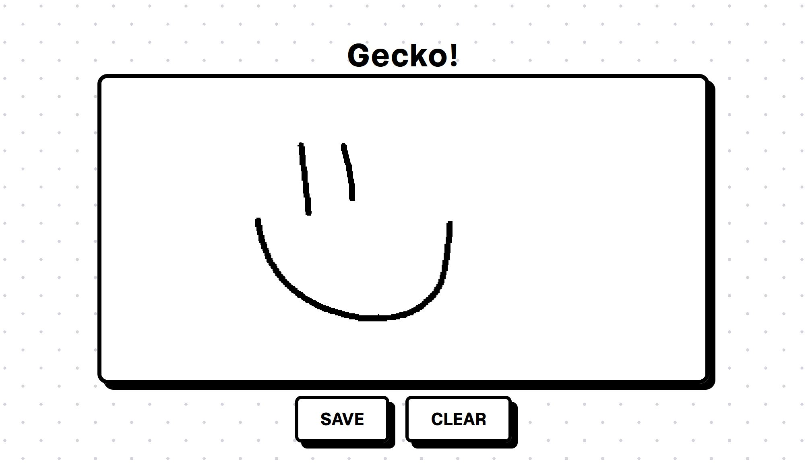

# Gecko Frontend



Canvas editor web app intended to integrate with The Gecko Project.

## Dev Environment Setup

The Gecko Frontend runs on Vue 3.5+ and Vite. To setup, run:

```bash
npm install
```

To run the application on port 8080, run:

```bash
npm run dev
```
